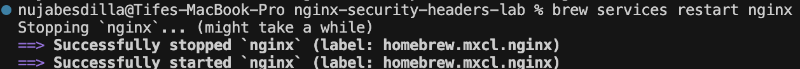
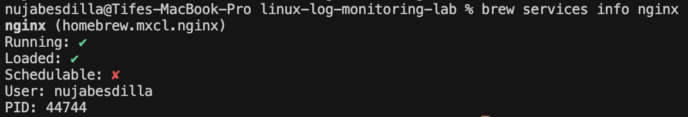
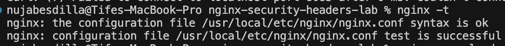
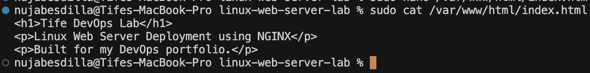
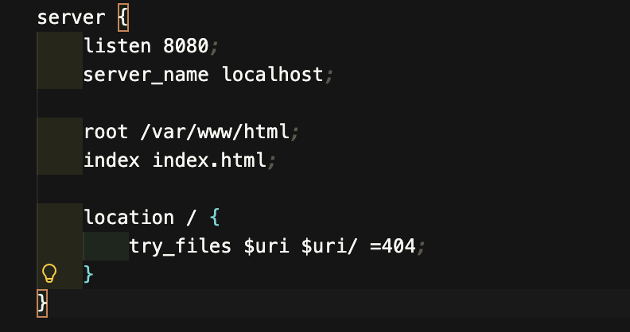
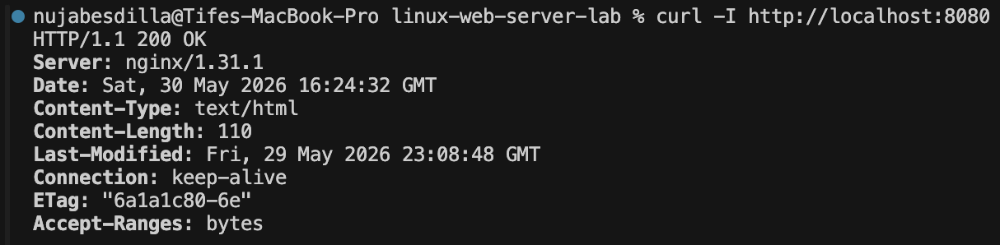
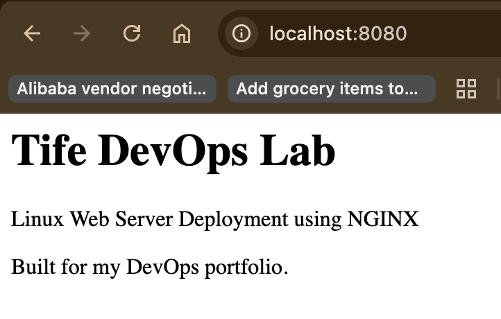

# Linux Web Server Deployment Lab

## Overview

Configured and deployed a local NGINX web server using Linux/macOS terminal commands.

This project demonstrates web server configuration, service management, local deployment, HTTP validation, and infrastructure troubleshooting.

---

## Architecture

```text
Browser
   ↓
NGINX Web Server
   ↓
Custom HTML Page
```

---

## Technologies Used

- Linux/macOS Terminal
- NGINX
- Bash
- VS Code
- Networking
- HTTP

---

## Tasks Completed

- Installed and managed NGINX
- Created a custom HTML web page
- Configured an NGINX server block
- Validated NGINX configuration syntax
- Restarted the NGINX service
- Tested HTTP connectivity using curl
- Documented the deployment with screenshots

---

## Commands Used

```bash
brew install nginx
brew services restart nginx
brew services info nginx
nginx -t
sudo mkdir -p /var/www/html
sudo nano /var/www/html/index.html
sudo cp nginx-lab.conf /usr/local/etc/nginx/servers/nginx-lab.conf
curl -I http://localhost:8080
```

---

## Screenshots

### NGINX Service Restart



---

### NGINX Service Status



---

### NGINX Configuration Test



---

### Custom HTML File



---

### NGINX Server Configuration



---

### HTTP Validation



---

### Browser Validation



---

## What I Learned

- How to configure an NGINX web server
- How to manage services from the terminal
- How to validate web server configuration
- How to troubleshoot HTTP connectivity
- How to document infrastructure projects professionally